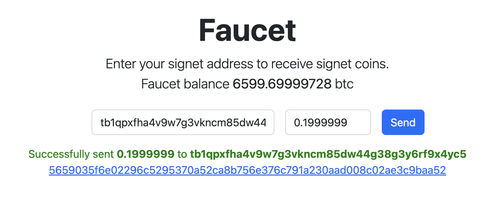

# A custom signet setup
A custom setup to bootstrap a signet bitcoin service with electrs, esplora and a custom http server for fauceting to a given address.

## How to run

1. Clone this repo and change to the signet directory
    ```bash
    git clone https://github.com/holzeis/signet
    cd signet
    ```
1. Run docker compose
    ```bash
    docker-compose up
    ```

This will start up a pre-configured and pre-mined custom signet bitcoind service, an electrum server (electrs) and a blockchain explorer (esplorer).

## How to get coins

After starting you can faucet your signet address at http://localhost:8080/faucet



